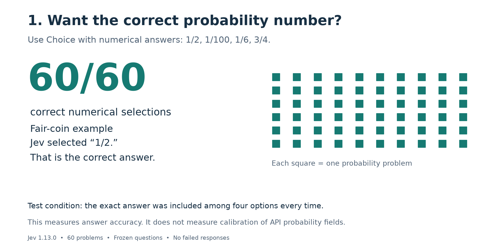
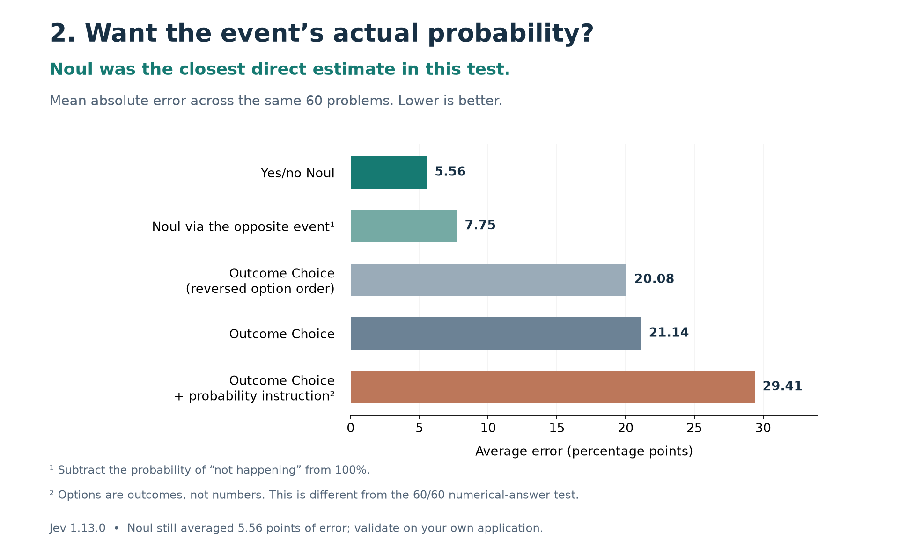

# Using Jev for probability questions: two different tasks

**Give Jev numerical options when you want it to select a probability answer. For a direct yes/no probability estimate, Noul was closest to the truth in this test.** These are different results, measured in different ways.

We tested Jev 1.13.0 on coins, dice, cards and other scenarios with exact mathematical answers. All 68 primary cases completed successfully. The main comparison uses the same 60 binary-event problems. Prompts were frozen before the run.

## 1. How should I ask for the correct numerical probability?

Use **Choice with numbers as the answers**. For example:

> A fair coin is flipped once. What is the probability of heads?
> Choose: **1/2, 1/100, 1/6, or 3/4.**

Jev selected **1/2**. Across all 60 problems, it selected the correct numerical probability **60 times out of 60**.



**What this tells a builder:** when your task is selecting a probability from supplied candidates, this approach worked very well here. Read the selected number as the answer. A high probability assigned to the option “1/2” means support for that answer; it does not mean the coin itself is almost certain to land heads.

**Boundary of the result:** we supplied the exact answer among four candidates every time. This measures answer-selection accuracy, not calibration or free-form calculation. We did not compare multiple numerical-answer methods, test a fixed percentage grid, or test what happens when the correct answer is absent. So this is a successful tested approach, not proof that Choice is universally the best way to solve probability problems.

## 2. Which output most closely matches an event's actual probability?

Here the options are **outcomes**, not numbers. We compare the returned probability with the event's mathematical chance.

For the same fair-coin scenario, simplified wording makes the distinction clear:

| Method | What we ask | What we read | Saved result | Correct value |
|---|---|---|---:|---:|
| Numerical-answer Choice | “What is the probability?” Options: 1/2, 1/100, 1/6, 3/4 | The selected number | **50%** | 50% |
| Yes/no Noul | “Will the heads event occur?” | Probability of yes | **55%** | 50% |
| Outcome Choice | “Which outcome will occur?” Options: event occurs / does not occur | Probability assigned to the event | **88%** | 50% |
| Outcome Choice + probability instruction | Same outcome options, asking the output probabilities to represent mathematical chances | Probability assigned to the event | **96%** | 50% |

All four examples above come from case P001. The earlier **94% heads** result comes from a separate case, P061, whose options are explicitly named “heads” and “tails.”

**Noul was the closest direct estimate:** its mean absolute error was **5.56 percentage points**, versus **21.14** for ordinary outcome Choice. Adding an explicit probability instruction to outcome Choice increased the error to **29.41 points** in this run. This instruction does **not** refer to the numerical-answer method that scored 60/60.



A 20-percentage-point error means, for example, returning 70% when the truth is 50%. Lower error is better. The chart compares five ways of obtaining an event probability on the same 60 cases, with no missing responses. The 60/60 numerical-answer result is deliberately shown in its own visual because counting correct answers is a different measurement.

## What should I use in practice?

| Your task | What this experiment supports | Important limit |
|---|---|---|
| Select a numerical probability from a finite set | Try **numerical-answer Choice** and read the selected value | The correct value must be represented; our exact-answer candidate sets were constructed using the known truth |
| Obtain a direct probability for a yes/no event | **Noul** is the best starting point among the methods tested here | It still made errors; validate its probabilities on examples from your application |
| Obtain a full distribution over several possible outcomes | Validate outcome Choice's distribution carefully before using it as real-world odds | We did not establish a reliable method for this task; independently estimating every outcome with Noul was not tested |
| Calculate exact odds from known counts or rules | Use deterministic calculations when practical | This is engineering guidance, not another model evaluated in the experiment |

Do not interpret the selected option's probability or Choice's separate `confidence` field as interchangeable with the event's chance. Do not assume independently asking about an event and its opposite will produce probabilities that add to 100%: Noul missed that total by **7.55 points on average**, and **25 points at worst**, here.

## Are these tests of “correct answers” and “calibration”?

Those are useful starting questions, but the precise questions answered here are:

1. **Can Jev select the correct numerical probability when it is offered as a candidate?** Yes, in 60/60 of these cases.
2. **How closely do Jev's probability outputs match known event probabilities?** Noul was closest among the direct-output methods tested.

The second is relevant to calibration, but we call the measured quantity **probability-estimation error**. A conventional calibration study would also ask whether events assigned, say, 70% happen about 70% of the time across relevant cases. This small, authored suite with analytically known chances does not establish calibration across real-world applications. The 60/60 result does not establish calibration of confidence in numerical answers, either.

The results reveal a difference in behavior across questions and outputs. They do not establish Jev's architecture or how it represents probability knowledge internally.

## What we tested

Experiment 007 tested Jev `jev-1.13.0` on 68 authored scenarios: 60 binary events and eight full outcome distributions. The binary scenarios cover fair and biased coins, dice, cards, sampling with and without replacement, uniform integers, conditional probabilities and Bayes’ rule. Each scenario states its random process and relevant observations. Ground truth uses exact fractions and combinatorics, with enumeration checks for coins, dice, cards and sampling without replacement.

Before any API calls, we froze the cases, prompts, source and scoring protocol. Each binary case received six independent questions against the same scenario:

1. Outcome Choice: “Which outcome will occur?”, with event/nonevent options.
2. Outcome Choice + probability instruction: the same options, asking for the mathematical outcome probabilities rather than confidence in the most likely option.
3. Outcome Choice with the option order reversed.
4. Noul: “Will the event described in `event` occur?”
5. Noul: the complementary question asking whether the event will not occur.
6. Numerical-answer Choice control: select the exact probability from four candidate fractions.

The eight distribution cases used the three Choice versions. We also repeated the first ten binary cases twice with identical requests. No prompts were tuned after inspecting results. All 88 requests and 504 question responses completed successfully. The primary suite contains 384 questions; repeats add 120 and are excluded from primary scores.

## Binary probability accuracy

Each error compares the returned event probability with its exact mathematical probability. A prediction of 70% when the truth is 50% has an error of 20 percentage points. All methods use the same 60 cases.

| Method | Mean absolute error, pp | RMSE, pp | Largest error, pp | Within 5 pp | Within 10 pp |
|---|---:|---:|---:|---:|---:|
| Outcome Choice | 21.14 | 26.37 | 52.23 | 15/60 | 19/60 |
| Outcome Choice + probability instruction | 29.41 | 34.99 | 72.00 | 9/60 | 13/60 |
| Outcome Choice, reversed options | 20.08 | 24.95 | 52.23 | 13/60 | 21/60 |
| Yes/no Noul | 5.56 | 7.36 | 22.33 | 38/60 | 51/60 |
| Noul via the opposite event | 7.75 | 9.67 | 24.33 | 25/60 | 46/60 |

An uninformed prediction of 50% for every case would average **25.58 points** of error on this particular suite. Plain Choice is better than that baseline; outcome Choice + probability instruction is worse. Noul is much better. The suite’s probability mix determines this baseline.

Outcome Choice generally overestimated the named event: its mean signed error was +20.46 points. This is a descriptive result for these prompts, not an explanation of Jev’s internal mechanism.

Four cases have probability zero or one. Excluding those controls, outcome Choice averages 22.63 points of error, outcome Choice + probability instruction 31.47, and Noul 5.87 across the remaining 56 cases.

### By family

| Family | Cases | Outcome Choice MAE, pp | Outcome Choice + probability instruction MAE, pp | Noul MAE, pp |
|---|---:|---:|---:|---:|
| biased coins | 6 | 20.94 | 30.77 | 5.31 |
| cards | 8 | 28.06 | 43.68 | 2.70 |
| coins | 12 | 27.56 | 38.89 | 6.82 |
| conditional | 8 | 14.87 | 22.25 | 9.96 |
| dice | 10 | 12.03 | 21.03 | 3.24 |
| sampling | 10 | 18.86 | 22.66 | 6.07 |
| uniform integers | 6 | 26.61 | 24.78 | 4.22 |

## Full outcome distributions

| Scenario | Outcome Choice | Outcome Choice + probability instruction | Outcome Choice, reversed options |
|---|---:|---:|---:|
| Fair coin | 44.00 | 47.00 | 43.00 |
| Fair six-sided die | 61.33 | 70.33 | 60.33 |
| Card suit | 40.00 | 57.00 | 34.00 |
| Heads count in two flips | 46.00 | 46.00 | 45.00 |
| Sum of two dice | 83.33 | 83.33 | 83.33 |
| Three-color bag | 30.00 | 28.00 | 30.00 |
| Four-color spinner | 50.00 | 49.00 | 49.00 |
| Two ordered coin flips | 44.00 | 54.80 | 52.00 |

Values above are **total variation distance × 100**: half the sum of the absolute errors across all outcomes, after normalizing any rounding discrepancy. Zero means the distributions match; 100 means they do not overlap. This differs from binary MAE and should not be pooled with it. The average is 49.83 for outcome Choice and 54.43 for outcome Choice + probability instruction across these eight examples.

For the fair die, outcome Choice assigned **78% to rolling a one**, instead of 16.67%. For the card suits, it assigned **65% to hearts**, instead of 25%. These were errors in the returned `probabilities`, not misuse of the separate `confidence` field.

## Numerical answers versus forecasts

The numerical control selected the correct fraction in **60/60 cases**. This is multiple-choice recognition with one correct candidate and three seeded distractors; it is not free-form calculation and may be easier than generating an answer. Candidate fractions were included only in that control question, never in shared state. TypeSafe documents independent processing of questions against the same state.

A high probability on the answer “1/2” can be appropriate when the question asks for the correct mathematical value. That is different from assigning a high probability to heads when predicting a fair coin. Our experiment measures these separately.

## Coherence and repeatability

- Separately asking Noul about an event and its opposite produced probabilities whose sums differed from 100% by **7.55 points on average**, and **25 points at worst**.
- Reversing binary Choice options changed the event probability by **3.37 points on average**, with a maximum of **10 points**.
- Identical-request repeats also changed output components, by up to **11 points** relative to the primary responses. None of the ten complete response vectors was identical in either repeat. Therefore we cannot attribute every order-change difference to order alone.
- Raw Choice distributions summed to within one percentage point of 100%. That rounding discrepancy is much smaller than the substantive errors. We retained raw outputs and normalized only for multiclass distribution metrics.

## Cost and speed

| Run | Requests | Input tokens | Output tokens | Wall time | Estimated cost, USD |
|---|---:|---:|---:|---:|---:|
| primary-v1 | 68/68 | 48,052 | 13,720 | 8.47 s | $0.00201818 |
| repeat-1 | 10/10 | 7,097 | 2,054 | 1.49 s | $0.00029807 |
| repeat-2 | 10/10 | 7,097 | 2,057 | 1.55 s | $0.00029807 |

Total estimated API cost: **US$0.00261433**, about **0.26 cents**, within the US$5 authorization. The primary run took 8.47 seconds; all three active run times sum to 11.52 seconds, excluding setup, analysis and gaps between runs. Median primary HTTP latency was 0.397 seconds. Runs used four workers and paced requests. These are not intrinsic single-question latency measurements.

Pricing used: US$0.042 per million input tokens; output tokens free. Cost is calculated from API-reported usage, not a billing invoice. There were no failed requests or retries. Total usage: 62,246 input and 17,831 output tokens.

## Interpretation and limitations

This is a diagnostic test of **known-probability fidelity**, not a broad reliability study against outcomes observed in deployment. Because the true random-process probabilities are analytically known, direct comparison does not require physically flipping coins or sampling dice. The small authored suite is not representative of all tasks, and related cases are not independent draws from a benchmark population. We do not attach population confidence intervals to these descriptive averages.

The strongest finding is a separation between choosing a correct numerical probability and expressing that probability in an outcome distribution. Noul behaved substantially better than Choice, so “Jev cannot do probability” would be too broad. Neither did we find a basis for trusting its probabilities without domain-specific checks.

The prompts may interact with learned preferences for choosing a single answer; the results do not prove that explanation. Numerical-answer Choice controls have candidate cues, and different wording, option names or model versions may behave differently. Common textbook patterns may occur in training, so this is not a contamination-resistant reasoning benchmark. All findings apply to the pinned model and frozen prompts used here.

Useful follow-ups would test preregistered paraphrases, counterbalanced option names and balanced repeats across all families; then evaluate probability calibration on independently labeled real-world tasks. None of those follow-ups was run here.

## Files and sources

- [All binary cases and errors](results/binary-results.csv)
- [All full outcome distributions](results/multiclass-results.csv)
- [Complete structured results](results/results.json)
- Code is in `src/`, inputs and exact answers in `data/`, raw API records in `runs/`, and summaries and charts in `results/`.
- Official TypeSafe documentation checked September 22, 2026: [Choice](https://docs.typesafe.ai/primitives/choice), [Noul](https://docs.typesafe.ai/primitives/noul), [confidence](https://docs.typesafe.ai/confidence), [API](https://docs.typesafe.ai/api), [models and pricing](https://docs.typesafe.ai/models). Retrieval provenance is included; third-party documentation snapshots remain in the original workspace.

The assistant authored and supervised the experiment. Jev supplied predictions; deterministic Python generated the mathematical answers, enforced the budget and computed all scores.

## Reproduce the saved results

This repository contains one experiment:

```text
src/          Code for the experiment, analysis and figures
data/         Questions and exact mathematical answers
runs/         Original API requests, responses and usage records
results/      Charts, CSV tables and summarized results
sources/      Frozen hashes and documentation provenance
PROTOCOL.md   The plan frozen before running the experiment
```

From the repository root, score the included API responses without credentials, network access or spending:

```sh
python3 src/analyze.py
```

This verifies the frozen input/source hashes, scores all saved runs, and recreates the JSON and CSV results under `results/`. Python's standard library is sufficient. To recreate the report and figures as well:

```sh
python3 -m venv .venv
source .venv/bin/activate
python -m pip install -r requirements.txt
python src/report.py
```

The report generator updates the report under `results/`; this root README includes additional publication and reproduction notes. Exact plotting environment versions are also recorded in `sources/plot-requirements.txt`.

The original [protocol](PROTOCOL.md), [cases](data/cases.json), [exact answers and derivations](data/answers.json), [frozen manifest](sources/frozen.json), and [raw runs](runs) are included. Official documentation links and retrieval provenance are included; third-party documentation snapshots are omitted from this publication.

### Optional fresh API run

Fresh API calls incur charges. Keep the published runs intact. In a separate scratch copy of this repository, replace the copied `runs/` directory with an empty one, and set `TYPESAFE_API_KEY` privately in your shell. From the repository root of that scratch copy, run:

```sh
python3 src/run.py primary-v1
python3 src/run.py repeat-1
python3 src/run.py repeat-2
python3 src/analyze.py
```

The runner refuses to overwrite existing named runs and enforces a shared US$5 cap using conservative per-attempt reservations. It uses the historical pinned model and price; confirm their availability and current pricing before a new run. Retain a fresh run's actual metrics rather than assuming the published numbers will repeat. The narrative report contains historical numerical summaries, so generating a report for new API results also requires updating that prose.
