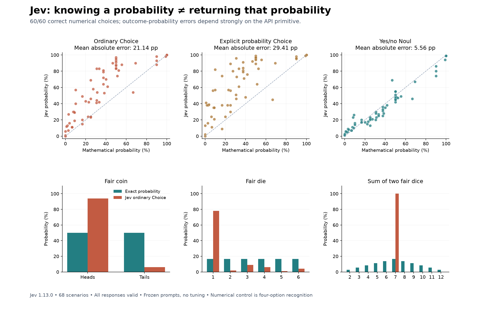

# Can Jev reproduce known probabilities?

## Summary

**Jev’s numerical answers and its probability outputs behaved very differently.** It selected the correct numerical probability in all 60 four-option controls. However, its ordinary Choice output probabilities averaged **21.14 percentage points** away from the mathematical probabilities. The dedicated yes/no primitive, Noul, was substantially closer at **5.56 points**, but was not exact or consistently coherent.

For a fair coin, a direct heads/tails Choice returned **94% heads and 6% tails**. For the sum of two fair dice, Choice assigned **100% to seven**, although the true probability is **16.67%**. Explicitly asking the output probabilities to represent the mathematical chances did not fix these examples.

This supports a narrow conclusion: **do not assume Jev’s Choice probabilities are reliable forecasts of random outcomes.** It does not establish that Jev cannot recognize correct probability calculations or that its classifications are poorly calibrated in every domain.



## What we tested

Experiment 007 tested Jev `jev-1.13.0` on 68 authored scenarios: 60 binary events and eight full outcome distributions. The binary scenarios cover fair and biased coins, dice, cards, sampling with and without replacement, uniform integers, conditional probabilities and Bayes’ rule. Each scenario states its random process and relevant observations. Ground truth uses exact fractions and combinatorics, with enumeration checks for coins, dice, cards and sampling without replacement.

Before any API calls, we froze the cases, prompts, source and scoring protocol. Each binary case received six independent questions against the same scenario:

1. Ordinary Choice: “Which outcome will occur?”, with event/nonevent options.
2. Explicit Choice: the same options, asking for the mathematical outcome probabilities rather than confidence in the most likely option.
3. Ordinary Choice with the option order reversed.
4. Noul: “Will the event described in `event` occur?”
5. Noul: the complementary question asking whether the event will not occur.
6. Numerical control: select the exact probability from four candidate fractions.

The eight distribution cases used the three Choice versions. We also repeated the first ten binary cases twice with identical requests. No prompts were tuned after inspecting results. All 88 requests and 504 question responses completed successfully. The primary suite contains 384 questions; repeats add 120 and are excluded from primary scores.

## Binary probability accuracy

Each error compares the returned event probability with its exact mathematical probability. A prediction of 70% when the truth is 50% has an error of 20 percentage points. All methods use the same 60 cases.

| Method | Mean absolute error, pp | RMSE, pp | Largest error, pp | Within 5 pp | Within 10 pp |
|---|---:|---:|---:|---:|---:|
| Choice: ordinary outcome question | 21.14 | 26.37 | 52.23 | 15/60 | 19/60 |
| Choice: explicit probability instructions | 29.41 | 34.99 | 72.00 | 9/60 | 13/60 |
| Choice: reversed option order | 20.08 | 24.95 | 52.23 | 13/60 | 21/60 |
| Noul: will the event occur? | 5.56 | 7.36 | 22.33 | 38/60 | 51/60 |
| Noul: 1 − probability of the opposite | 7.75 | 9.67 | 24.33 | 25/60 | 46/60 |

An uninformed prediction of 50% for every case would average **25.58 points** of error on this particular suite. Plain Choice is better than that baseline; explicit Choice is worse. Noul is much better. The suite’s probability mix determines this baseline.

Ordinary Choice generally overestimated the named event: its mean signed error was +20.46 points. This is a descriptive result for these prompts, not an explanation of Jev’s internal mechanism.

Four cases have probability zero or one. Excluding those controls, ordinary Choice averages 22.63 points of error, explicit Choice 31.47, and Noul 5.87 across the remaining 56 cases.

### By family

| Family | Cases | Ordinary Choice MAE, pp | Explicit Choice MAE, pp | Noul MAE, pp |
|---|---:|---:|---:|---:|
| biased coins | 6 | 20.94 | 30.77 | 5.31 |
| cards | 8 | 28.06 | 43.68 | 2.70 |
| coins | 12 | 27.56 | 38.89 | 6.82 |
| conditional | 8 | 14.87 | 22.25 | 9.96 |
| dice | 10 | 12.03 | 21.03 | 3.24 |
| sampling | 10 | 18.86 | 22.66 | 6.07 |
| uniform integers | 6 | 26.61 | 24.78 | 4.22 |

## Full outcome distributions

| Scenario | Ordinary Choice | Explicit Choice | Reversed Choice |
|---|---:|---:|---:|
| Fair coin | 44.00 | 47.00 | 43.00 |
| Fair six-sided die | 61.33 | 70.33 | 60.33 |
| Card suit | 40.00 | 57.00 | 34.00 |
| Heads count in two flips | 46.00 | 46.00 | 45.00 |
| Sum of two dice | 83.33 | 83.33 | 83.33 |
| Three-color bag | 30.00 | 28.00 | 30.00 |
| Four-color spinner | 50.00 | 49.00 | 49.00 |
| Two ordered coin flips | 44.00 | 54.80 | 52.00 |

Values above are **total variation distance × 100**: half the sum of the absolute errors across all outcomes, after normalizing any rounding discrepancy. Zero means the distributions match; 100 means they do not overlap. This differs from binary MAE and should not be pooled with it. The average is 49.83 for ordinary Choice and 54.43 for explicit Choice across these eight examples.

For the fair die, ordinary Choice assigned **78% to rolling a one**, instead of 16.67%. For the card suits, it assigned **65% to hearts**, instead of 25%. These were errors in the returned `probabilities`, not misuse of the separate `confidence` field.

## Numerical answers versus forecasts

The numerical control selected the correct fraction in **60/60 cases**. This is multiple-choice recognition with one correct candidate and three seeded distractors; it is not free-form calculation and may be easier than generating an answer. Candidate fractions were included only in that control question, never in shared state. TypeSafe documents independent processing of questions against the same state.

A high probability on the answer “1/2” can be appropriate when the question asks for the correct mathematical value. That is different from assigning a high probability to heads when predicting a fair coin. Our experiment measures these separately.

The 60/60 score measures answer accuracy, not calibration of confidence in those answers. It therefore cannot be ranked as “more calibrated” than Noul. These results also do not reveal Jev's internal representation or architecture: recognizing a correct fraction while returning an inaccurate outcome distribution does not establish that Jev reasons or stores knowledge like a generative LLM.

## Coherence and repeatability

- Separately asking Noul about an event and its opposite produced probabilities whose sums differed from 100% by **7.55 points on average**, and **25 points at worst**.
- Reversing binary Choice options changed the event probability by **3.37 points on average**, with a maximum of **10 points**.
- Identical-request repeats also changed output components, by up to **11 points** relative to the primary responses. None of the ten complete response vectors was identical in either repeat. Therefore we cannot attribute every order-change difference to order alone.
- Raw Choice distributions summed to within one percentage point of 100%. That rounding discrepancy is much smaller than the substantive errors. We retained raw outputs and normalized only for multiclass distribution metrics.

## Cost and speed

| Run | Requests | Input tokens | Output tokens | Wall time | Estimated cost, USD |
|---|---:|---:|---:|---:|---:|
| primary-v1 | 68/68 | 48,052 | 13,720 | 8.47 s | $0.00201818 |
| repeat-1 | 10/10 | 7,097 | 2,054 | 1.49 s | $0.00029807 |
| repeat-2 | 10/10 | 7,097 | 2,057 | 1.55 s | $0.00029807 |

Total estimated API cost: **US$0.00261433**, about **0.26 cents**, within the US$5 authorization. The primary run took 8.47 seconds; all three active run times sum to 11.52 seconds, excluding setup, analysis and gaps between runs. Median primary HTTP latency was 0.397 seconds. Runs used four workers and paced requests. These are not intrinsic single-question latency measurements.

Pricing used: US$0.042 per million input tokens; output tokens free. Cost is calculated from API-reported usage, not a billing invoice. There were no failed requests or retries. Total usage: 62,246 input and 17,831 output tokens.

## Interpretation and limitations

This is a diagnostic test of **known-probability fidelity**, not a broad reliability study against outcomes observed in deployment. Because the true random-process probabilities are analytically known, direct comparison does not require physically flipping coins or sampling dice. The small authored suite is not representative of all tasks, and related cases are not independent draws from a benchmark population. We do not attach population confidence intervals to these descriptive averages.

The strongest finding is a separation between choosing a correct numerical probability and expressing that probability in an outcome distribution. Noul behaved substantially better than Choice, so “Jev cannot do probability” would be too broad. Neither did we find a basis for trusting its probabilities without domain-specific checks.

The prompts may interact with learned preferences for choosing a single answer; the results do not prove that explanation. Numerical controls have candidate cues, and different wording, option names or model versions may behave differently. Common textbook patterns may occur in training, so this is not a contamination-resistant reasoning benchmark. All findings apply to the pinned model and frozen prompts used here.

Useful follow-ups would test preregistered paraphrases, counterbalanced option names and balanced repeats across all families; then evaluate probability calibration on independently labeled real-world tasks. None of those follow-ups was run here.

## Files and sources

- [All binary cases and errors](outputs/known-probabilities/binary-results.csv)
- [All full outcome distributions](outputs/known-probabilities/multiclass-results.csv)
- [Complete structured results](outputs/known-probabilities/results.json)
- Experiment source, frozen protocol, exact-answer derivations and raw API traces are stored in workspace experiment `007-known-probabilities`.
- Official TypeSafe documentation checked September 22, 2026: [Choice](https://docs.typesafe.ai/primitives/choice), [Noul](https://docs.typesafe.ai/primitives/noul), [confidence](https://docs.typesafe.ai/confidence), [API](https://docs.typesafe.ai/api), [models and pricing](https://docs.typesafe.ai/models). Copies and retrieval provenance are retained in the experiment.

The assistant authored and supervised the experiment. Jev supplied predictions; deterministic Python generated the mathematical answers, enforced the budget and computed all scores.

## Reproduce the saved results

From the repository root, score the included API responses without credentials, network access or spending:

```sh
python3 experiments/007-known-probabilities/src/analyze.py
```

This verifies the frozen input/source hashes, scores all saved runs, and recreates the JSON and CSV results under `outputs/known-probabilities/`. Python's standard library is sufficient. To recreate the report and figures as well:

```sh
python3 -m venv .venv
source .venv/bin/activate
python -m pip install -r requirements.txt
python experiments/007-known-probabilities/src/report.py
```

The report generator updates the report under `outputs/known-probabilities/`; this root README includes additional publication and reproduction notes. Exact plotting environment versions are also recorded in `experiments/007-known-probabilities/sources/plot-requirements.txt`.

The original [protocol](experiments/007-known-probabilities/PROTOCOL.md), [cases](experiments/007-known-probabilities/data/cases.json), [exact answers and derivations](experiments/007-known-probabilities/data/answers.json), [frozen manifest](experiments/007-known-probabilities/sources/frozen.json), and [raw runs](experiments/007-known-probabilities/runs) are included. Official documentation links and retrieval provenance are included; third-party documentation snapshots are omitted from this publication.

### Optional fresh API run

Fresh API calls incur charges. Keep the published runs intact. In a separate scratch copy of the experiment directory, replace the copied `runs/` directory with an empty one, and set `TYPESAFE_API_KEY` privately in your shell. From the repository root of that scratch copy, run:

```sh
python3 experiments/007-known-probabilities/src/run.py primary-v1
python3 experiments/007-known-probabilities/src/run.py repeat-1
python3 experiments/007-known-probabilities/src/run.py repeat-2
python3 experiments/007-known-probabilities/src/analyze.py
```

The runner refuses to overwrite existing named runs and enforces a shared US$5 cap using conservative per-attempt reservations. It uses the historical pinned model and price; confirm their availability and current pricing before a new run. Retain a fresh run's actual metrics rather than assuming the published numbers will repeat. The narrative report contains historical numerical summaries, so generating a report for new API results also requires updating that prose.
